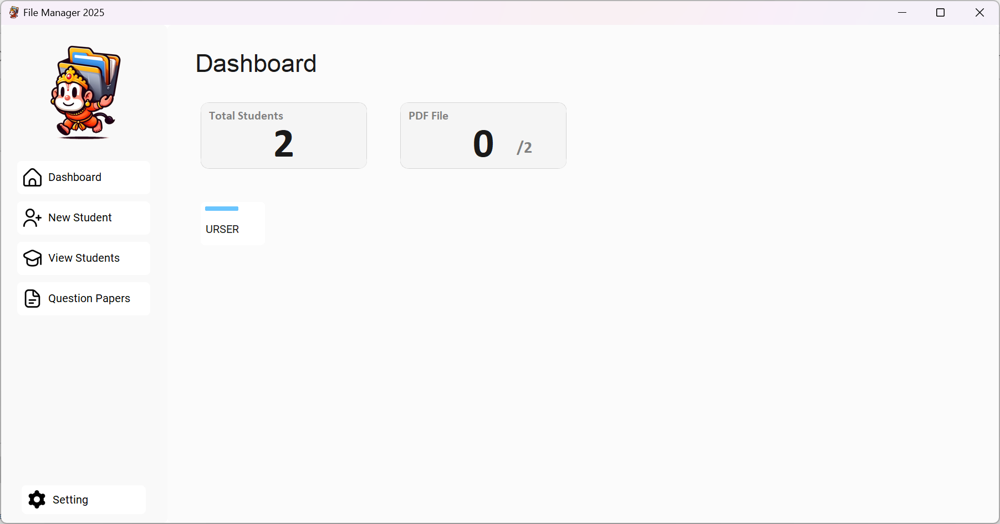
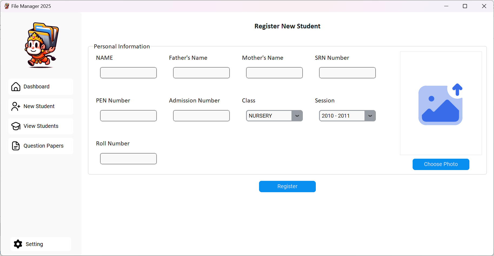
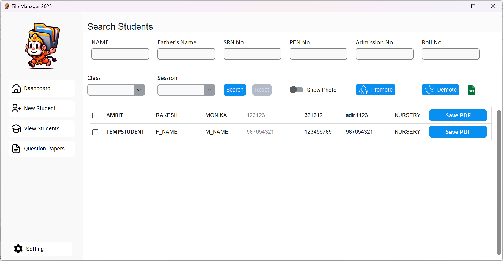
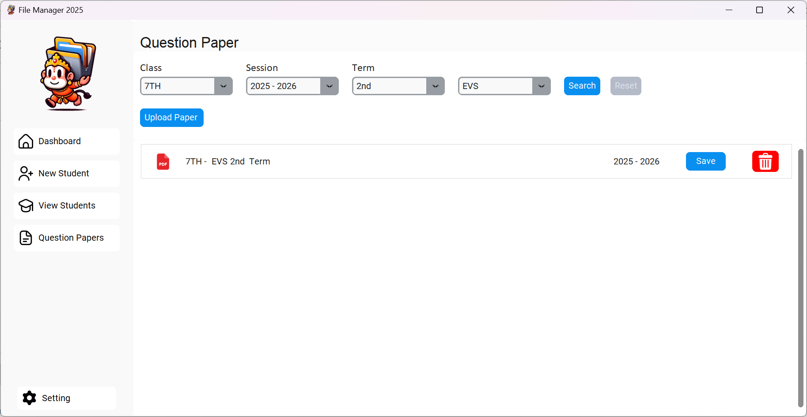
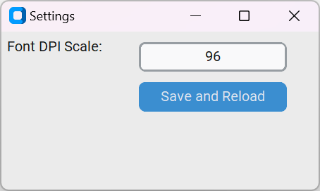

# File Manager 2025

The Student Data Management System is a Python-based desktop application GUI designed for efficiently managing student data. It provides a user-friendly interface for storing and managing various student details such as name, roll number, SRN (Student Registration Number), and other personal documents like parent documents in PDF format. Additionally, the application allows users to save academic details for students for three terms - first, second, and final terms.

## Features

- **Student Data Storage**: Easily store and manage student details including name, roll number, SRN, and parent documents in PDF format.
- **Academic Details**: Record and manage academic details for students for three terms - first, second, and final terms.
- **Certificate Creation**: Generate certificates using a document Word file as a template for various purposes.
- **Question Paper**: Record of question paper for each session with each terms.
- **Modern GUI Design**: The GUI is created using Tkinter with a modern design approach, providing easy user interactions and a pleasant user experience.

## Usage

1. **Student Data Entry**: Enter and save student details including personal information and academic details.
2. **PDF Document Management**: Upload and manage PDF documents such as parent documents.
3. **Academic Record Management**: Record and manage academic details for students for different terms.
4. **Certificate Generation**: Generate certificates using a document Word file as a template.

## Technologies Used

- Python
- customtkinter (for GUI)
- MySQL (for database management)

## Screenshots







## Video Demo

[](https://www.youtube.com/watch?v=eBxpffvhZwo&ab_channel=AmritPixels)

## Installation

1. Clone the repository:

   ```bash
   git clone https://github.com/CodeByAmrit/file_manager_2025.git
2. Install dependencies:

   ```bash
   pip install -r requirements.txt
3. Run the application:

   ```bash
   python File_Manager.py

# Contributing

Contributions are welcome! Please feel free to submit a pull request or open an issue if you find any bugs or have any suggestions for improvements.
